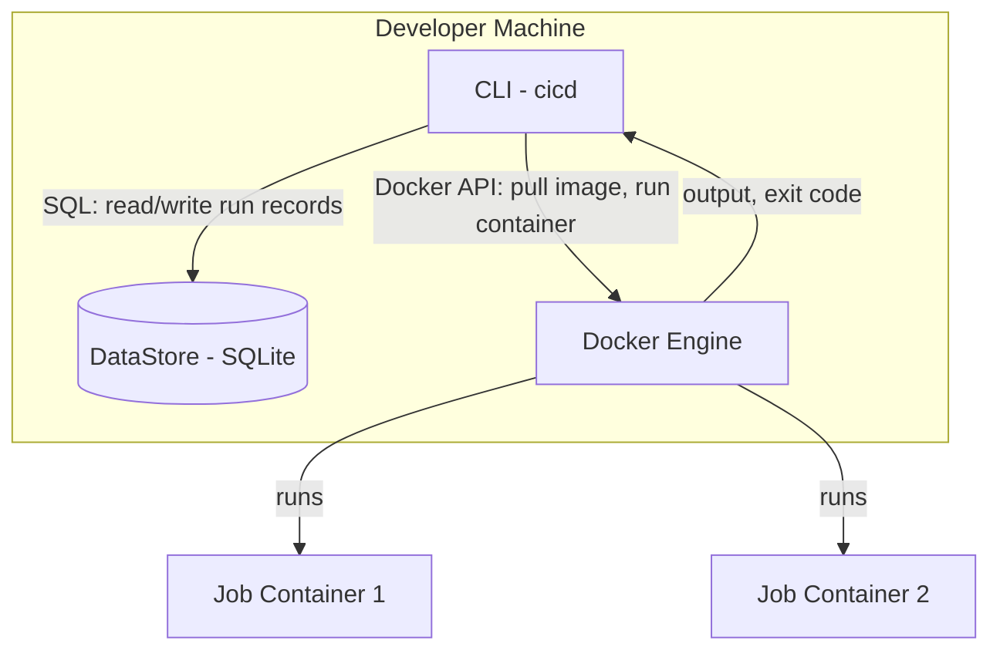
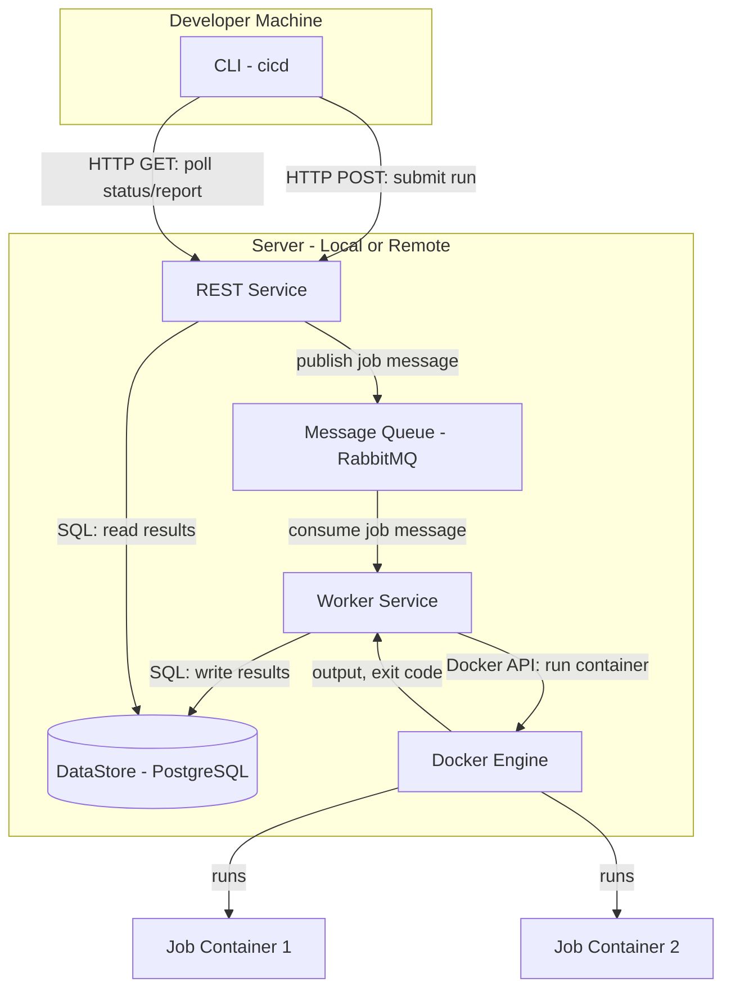

# Alternative Designs Considered

This document describes alternative architectures that the team evaluated before selecting the current design (REST-based service architecture). For each alternative, we provide a description, a diagram, pros and cons, and the reason the team chose not to adopt it.

---

## Alternative 1: Direct Local Execution (No REST Middle Layer)

### Description

In this design, the CLI directly orchestrates pipeline execution without going through a REST service. The CLI calls the Docker Engine API and writes to the DataStore in-process. A REST service is only introduced later in Phase 2 for remote execution.

### How It Works

1. The CLI parses and validates the YAML configuration (same as current design).
2. For `run`: the CLI directly calls the Docker API (via docker-java) to pull images and start containers. It writes run/stage/job records directly to a local SQLite database.
3. For `report`: the CLI queries SQLite directly and formats the output.
4. In Phase 2, a REST service would be introduced as an intermediary, requiring significant refactoring of the `run` and `report` commands.

### Pros

1. **Simpler Phase 1** -- No need to set up or run a separate REST service process. The CLI is the only thing the developer runs.
2. **Lower latency** -- No HTTP overhead; Docker and database calls happen in-process.
3. **Easier to debug locally** -- Fewer moving parts means fewer things that can go wrong during development.
4. **Faster time to market** -- Phase 1 can be delivered sooner since there is less infrastructure to build.

### Cons

1. **Major refactoring for Phase 2** -- When remote execution is needed, the Docker and DataStore logic embedded in the CLI must be extracted into a service. This is a significant architectural change.
2. **Tight coupling** -- The CLI becomes responsible for orchestration, persistence, and container management, violating separation of concerns.
3. **Two different code paths** -- Local mode (direct calls) and remote mode (REST calls) would need separate implementations for the same operations, increasing maintenance burden.
4. **No concurrent access** -- SQLite does not handle concurrent writes well. If multiple pipelines run simultaneously, there could be database locking issues.

### Why We Did Not Select This Design

While this approach is simpler for Phase 1, the requirement explicitly states that the CLI must communicate with other components "in a way that allows the CLI to be on one machine and other components on different machines." Building a direct-call architecture first and then retrofitting a REST layer would require rewriting the `run` and `report` command internals. The team decided it was better to invest in the REST architecture upfront to avoid a costly Phase 2 migration and to maintain a single code path for both local and remote modes.

---

## Alternative 2: Message Queue-Driven Architecture

### Description

In this design, the CLI does not call the REST service synchronously. Instead, it publishes pipeline execution requests to a message queue (e.g., RabbitMQ). A separate Worker service consumes messages from the queue, executes jobs via Docker, and writes results to the DataStore. The CLI polls the DataStore (via REST) for status updates.

### How It Works

1. The CLI submits a `run` request to the REST service.
2. The REST service breaks the pipeline into individual job messages and publishes them to a message queue, respecting stage ordering and `needs` dependencies.
3. Worker processes consume messages from the queue, pull Docker images, run containers, and write results back to the DataStore.
4. The CLI periodically polls the REST service for status updates, or the REST service streams updates back.
5. For `report`, the CLI queries the REST service, which reads from the DataStore.

### Pros

1. **Horizontal scalability** -- Multiple workers can consume from the queue in parallel, enabling execution across multiple machines.
2. **Fault tolerance** -- If a worker crashes, unacknowledged messages return to the queue and are retried by another worker.
3. **Decoupled execution** -- The REST service does not block while jobs run. It simply enqueues work and returns immediately.
4. **Natural fit for remote mode** -- Workers can run on any machine with Docker access, making Phase 2 deployment straightforward.

### Cons

1. **Significant infrastructure overhead** -- Requires running a message queue service (RabbitMQ/Redis) in addition to the REST service and DataStore. This is heavy for a small/medium company.
2. **Complex for local mode** -- Running RabbitMQ locally just to execute a simple pipeline adds unnecessary complexity for developers.
3. **Harder to debug** -- Asynchronous message-based systems are inherently harder to trace and debug than synchronous REST calls.
4. **Ordering complexity** -- Ensuring stages run sequentially and jobs respect `needs` dependencies requires careful message ordering and coordination logic in the queue consumer.
5. **Overkill for current scale** -- The system is designed for a small/medium company. The scalability benefits of a message queue are not needed at this stage.

### Why We Did Not Select This Design

The message queue approach is well-suited for large-scale distributed CI/CD systems, but it introduces significant complexity that is not justified by our current requirements. The small/medium company we are building for does not need horizontal worker scaling. The added infrastructure (RabbitMQ), the async coordination logic, and the debugging difficulty outweigh the scalability benefits. Our chosen REST-based synchronous design is simpler, easier to reason about, and sufficient for both Phase 1 (local) and Phase 2 (remote) without the overhead of a message broker.
