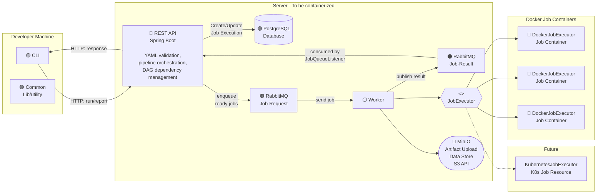

# High-Level Design

## Overview

This document expands on the initial design with a detailed high-level architecture for our custom CI/CD system. The system allows developers to define, validate, and execute CI/CD pipelines locally (Phase 1) or remotely (Phase 2). All pipeline configuration is stored as YAML files in the repository under `.pipelines/`.

## High-Level Design Diagram


### Component Communication Summary

| From | To | Protocol | Direction | Purpose |
|------|----|----------|-----------|---------|
| CLI | REST Service | HTTP/REST | Unidirectional (request) | Submit run requests (metadata only: repo URL, branch, commit, pipeline name), query reports |
| REST Service | CLI | HTTP/REST | Unidirectional (response) | Return execution results, report data |
| REST Service | Git Repository | Git (JGit / CLI) | Unidirectional | Clone repo at specified branch/commit to obtain pipeline config and source code |
| REST Service | DataStore | SQL (JDBC) | Bidirectional | Read/write pipeline run records, stage/job status |
| REST Service | Docker Engine | Docker API (HTTP) | Bidirectional | Pull images, create/start/stop containers (with cloned repo mounted as volume), read output |

**Note:** The CLI also performs local-only operations (verify, dryrun) that do not involve the REST Service. These operations parse and validate YAML files entirely within the CLI process.

## System Components

### 1. CLI (Command Line Interface)

The CLI (`cicd`) is the primary user-facing interface built with picocli.

**Responsibilities:**
- Parse and validate pipeline configuration files locally for `verify` and `dryrun` (YAML v1.2)
- Compute and display execution order (dryrun)
- For `run`: validate that `--branch`/`--commit` match the current checkout, then send metadata (repo URL, branch, commit, pipeline name) to the REST Service. The CLI does **not** send pipeline config or source code.
- Display pipeline status and reports to users

**Subcommands:**

| Command | Requires REST? | Description |
|---------|---------------|-------------|
| `verify` | No | Validate YAML configuration files locally |
| `dryrun` | No | Preview execution order without running |
| `run` | Yes | Execute a pipeline via the REST Service |
| `report` | Yes | Query execution history from the DataStore |

### 2. REST Service (Spring Boot)

The REST Service is the backend that orchestrates pipeline execution and manages state. It acts as the central coordinator between the CLI, DataStore, and Docker Engine.

**Responsibilities:**
- Receive and process requests from CLI
- Clone the git repository at the specified branch and commit into a temporary directory
- Read and validate the pipeline configuration from `.pipelines/` in the cloned repo
- Manage pipeline execution lifecycle (stages run sequentially, jobs within a stage respect `needs` ordering)
- Coordinate Docker container operations (pull images, run containers with cloned repo mounted as a volume, collect output)
- Store and retrieve execution data from DataStore
- Track git metadata (branch, commit hash, repo) for each run
- Clean up the cloned temporary directory after the pipeline run completes

**Key Endpoints:**

| Method | Endpoint | Description |
|--------|----------|-------------|
| `POST` | `/pipelines/run` | Start a pipeline execution. Payload: `{repoUrl, branch, commit, pipelineName}` |
| `GET` | `/pipelines/{name}/runs` | Get all runs for a pipeline |
| `GET` | `/pipelines/{name}/runs/{runNo}` | Get a specific run |
| `GET` | `/pipelines/{name}/runs/{runNo}/stages/{stage}` | Get a specific stage in a run |
| `GET` | `/pipelines/{name}/runs/{runNo}/stages/{stage}/jobs/{job}` | Get a specific job |

### 3. DataStore (SQLite / PostgreSQL)

The DataStore persists all pipeline execution data.

**Responsibilities:**
- Store pipeline execution history (run-no, status, timestamps, git info)
- Record stage execution details (pipeline, status, timestamps)
- Record job execution details (name, stage, pipeline, status, timestamps)
- Support querying historical runs for the `report` command

**Data Model:**

| Table | Key Fields |
|-------|------------|
| `pipeline_runs` | run-no, pipeline name, status, start-time, end-time, git-repo, git-branch, git-hash |
| `stage_runs` | pipeline, run-no, stage name, status, start-time, end-time |
| `job_runs` | pipeline, run-no, stage, job name, status, start-time, end-time |

**Storage Strategy:**
- **Local mode (Phase 1):** SQLite file-based database. No external setup required. Data is lost when the system is torn down (per requirements FAQ).
- **Remote mode (Phase 2):** PostgreSQL. Persistent across restarts (per requirements FAQ).

### 4. Docker Engine

Docker Engine runs the actual CI/CD jobs as containers.

**Responsibilities:**
- Pull Docker images specified in pipeline configuration (`image` field)
- Create and start containers for each job
- Execute `script` commands inside the container
- Return container output and exit codes to the REST Service

## Deployment Modes

### Local Mode (Phase 1)

All components run on the same developer machine:

```
Developer Machine
├── CLI (cicd)              -- user runs commands here
├── REST Service            -- runs as local process (localhost)
├── DataStore (SQLite)      -- file on local disk
└── Docker Engine           -- runs containers locally
```

### Remote Mode (Phase 2)

CLI runs locally, everything else runs remotely:

```
Developer Machine           Remote Server
├── CLI (cicd)              ├── REST Service
                            ├── DataStore (PostgreSQL)
                            └── Docker Engine
```

The transition from local to remote only requires changing the REST Service URL in the CLI configuration -- no architectural changes.

## Pros and Cons of This Design

### Pros

1. **Clean separation of concerns** -- Each component has a single responsibility (CLI for user interaction, REST for orchestration, DataStore for persistence, Docker for execution).
2. **Network-ready from day one** -- Using REST/HTTP between CLI and the service means the same architecture works for both local and remote modes without redesign.
3. **Technology flexibility** -- Components communicate via standard protocols (HTTP, SQL, Docker API), so individual components can be replaced independently (e.g., swap SQLite for PostgreSQL).
4. **Scalability path** -- The REST service could be scaled horizontally in the future, and Docker containers could run on multiple worker nodes.
5. **Debuggability** -- REST APIs are easy to inspect and test independently using tools like curl or Postman.

### Cons

1. **Overhead for local mode** -- Running a REST service locally adds startup time and complexity compared to direct in-process calls.
2. **More moving parts** -- Developers need to have the REST Service running before they can use `run` or `report` commands.
3. **Network dependency** -- Even in local mode, the CLI-to-REST communication goes over HTTP, adding latency compared to direct function calls.
4. **Deployment complexity** -- Setting up the full system requires starting multiple processes (REST service, database, Docker), which increases the barrier for first-time setup.

### Why We Chose This Design

The primary requirement states that "the CLI component must communicate with other components in a way that allows the CLI to be on one machine and other components on different machines." This rules out a purely in-process architecture. By using REST/HTTP from the start, we avoid a costly redesign when transitioning from Phase 1 (local) to Phase 2 (remote). The overhead of running a local REST service is an acceptable trade-off for architectural consistency and a clean Phase 2 migration path.
