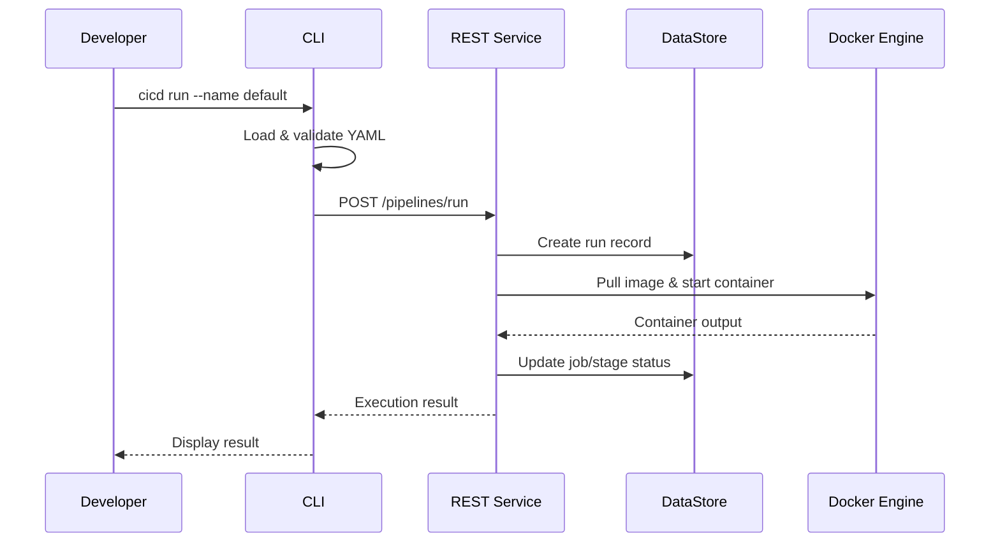
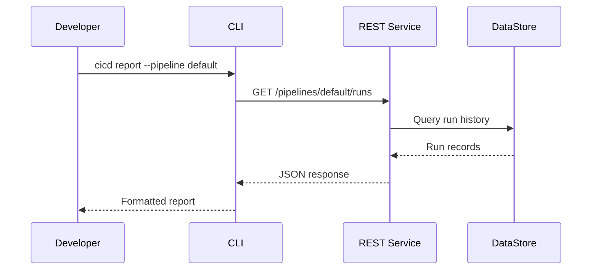

# Initial High-Level Design

## Overview

This document describes the initial architecture for our custom CI/CD system. The system allows developers to define, validate, and execute CI/CD pipelines locally or remotely.

## System Components

### 1. CLI (Command Line Interface)

The CLI is the primary interface for developers to interact with the CI/CD system.

**Responsibilities:**
- Parse and validate pipeline configuration files (YAML)
- Send pipeline execution requests to the REST Service
- Display pipeline status and reports to users
- Support local development workflows

**Key Features:**
- `verify` - Validate pipeline configuration files
- `dryrun` - Preview execution order without running
- `run` - Execute a pipeline
- `report` - View execution history and logs

### 2. REST Service

The REST Service is the backend that orchestrates pipeline execution and manages state.

**Responsibilities:**
- Receive and process requests from CLI
- Manage pipeline execution lifecycle
- Coordinate Docker container operations
- Store and retrieve execution data from DataStore
- Provide API endpoints for pipeline management

**Key Endpoints:**
- `POST /pipelines/run` - Start a pipeline execution
- `GET /pipelines/{name}/status` - Get pipeline status
- `GET /pipelines/{name}/runs` - Get execution history
- `GET /runs/{runId}` - Get specific run details

### 3. DataStore

The DataStore persists all pipeline execution data and logs.

**Responsibilities:**
- Store pipeline execution history
- Record stage and job execution details
- Maintain timestamps, status, and git metadata
- Support querying historical runs

**Data Stored:**
- Pipeline runs (start-time, end-time, status, run-no, git info)
- Stage executions (pipeline, start-time, end-time, status)
- Job executions (name, stage, pipeline, start-time, end-time, status)
- Execution logs

## Component Communication

```
┌─────────────────────────────────────────────────────────────────┐
│                        Developer Machine                        │
│  ┌─────────┐                                                    │
│  │   CLI   │                                                    │
│  └────┬────┘                                                    │
└───────┼─────────────────────────────────────────────────────────┘
        │ HTTP/REST
        ▼
┌─────────────────────────────────────────────────────────────────┐
│                      Server (Local or Remote)                   │
│  ┌──────────────────┐         ┌─────────────────┐               │
│  │   REST Service   │◄───────►│    DataStore    │               │
│  └────────┬─────────┘  SQL    │   (PostgreSQL)  │               │
│           │                   └─────────────────┘               │
│           │ Docker API                                          │
│           ▼                                                     │
│  ┌──────────────────┐                                           │
│  │  Docker Engine   │                                           │
│  │  ┌────┐ ┌────┐   │                                           │
│  │  │Job1│ │Job2│   │                                           │
│  │  └────┘ └────┘   │                                           │
│  └──────────────────┘                                           │
└─────────────────────────────────────────────────────────────────┘
```

## Communication Flow

### Pipeline Execution Flow



### Report Query Flow



## Deployment Modes

### Local Mode (Phase 1)
All components run on the developer's machine:
- CLI executes directly
- REST Service runs as local process
- DataStore uses SQLite (file-based)
- Docker runs locally

### Remote Mode (Phase 2)
CLI connects to remote infrastructure:
- CLI runs on developer machine
- REST Service runs on remote server
- DataStore uses PostgreSQL (persistent)
- Docker runs on remote server

## Design Decisions

| Decision | Choice | Rationale |
|----------|--------|-----------|
| CLI Framework | picocli | Mature Java CLI library with subcommand support |
| API Protocol | REST/HTTP | Simple, widely supported, easy to debug |
| Data Format | JSON | Standard format for API communication |
| Config Format | YAML | Human-readable, industry standard for CI/CD |
| Container Runtime | Docker | Industry standard, wide image availability |
