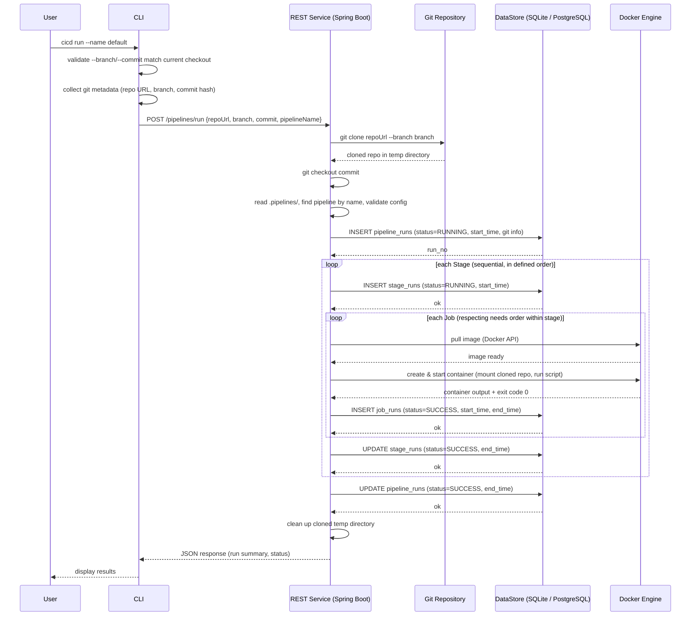
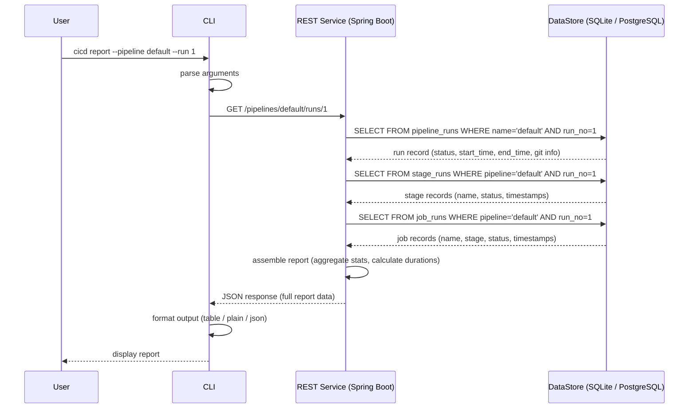

# Sequence Diagrams

## 1. Pipeline Execution (`cicd run`)

Happy path — all stages and jobs succeed.

### Step Descriptions

- **Branch/commit validation**: CLI checks that `--branch` and `--commit` (if provided) match the currently checked-out state. If they don't match, CLI exits with an error (the system does not switch branches).
- **Git metadata**: CLI collects the current repo URL (local path or remote), branch, and commit hash.
- **POST /pipelines/run**: CLI sends only metadata (`repoUrl`, `branch`, `commit`, `pipelineName`) to the REST Service over HTTP. No pipeline config or source code is sent.
- **Git clone**: REST Service clones the repository at the specified branch and checks out the exact commit into a temporary directory. This guarantees that only committed code is used.
- **Config validation**: REST Service reads `.pipelines/` from the cloned repo, finds the pipeline by name, and validates the config (same rules as `verify`). This is the source of truth -- even if the CLI validated locally, the REST Service re-validates from the committed state.
- **Create pipeline run**: REST Service inserts a new row in `pipeline_runs` table with status RUNNING, DB returns the assigned run_no.
- **Stage loop**: Stages execute sequentially in the order defined in the config. For each stage, a row is inserted into `stage_runs`.
- **Job loop**: Within a stage, jobs run respecting `needs` ordering. REST Service pulls the Docker image, creates a container with the cloned repo mounted as a volume, and runs the script commands.
- **Record job result**: After each container finishes, REST Service writes the result to `job_runs` (status, timestamps).
- **Update stage/pipeline**: Once all jobs in a stage succeed, the stage is marked SUCCESS. After all stages complete, the pipeline run is marked SUCCESS.
- **Cleanup**: REST Service deletes the cloned temporary directory.
- **Return results**: REST Service returns a JSON response with the run summary; CLI formats and displays it.

---

## 2. Report Request (`cicd report`)

Query the report for a specific pipeline run.

### Step Descriptions

- **Parse arguments**: CLI extracts pipeline name (`default`) and run number (`1`) from the command
- **GET /pipelines/default/runs/1**: CLI sends the report request to the REST Service over HTTP
- **Query pipeline run**: REST Service queries the `pipeline_runs` table for the matching run record
- **Query stages**: REST Service queries `stage_runs` for all stages in that run
- **Query jobs**: REST Service queries `job_runs` for all jobs in that run
- **Assemble report**: REST Service aggregates the data — total duration, per-stage/per-job timing, success/failure counts
- **Return report**: REST Service sends the assembled report back as JSON
- **Format & display**: CLI formats the output based on user preference (table, plain text, or raw JSON) and displays it