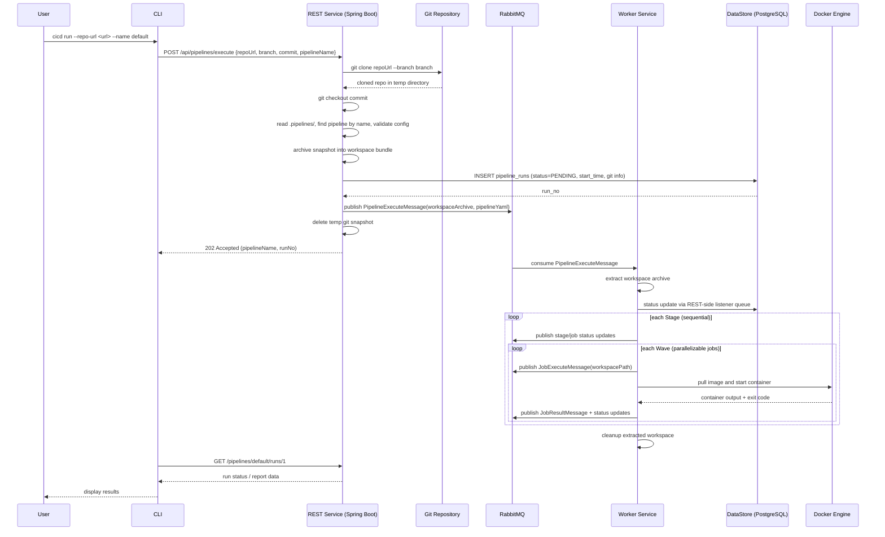
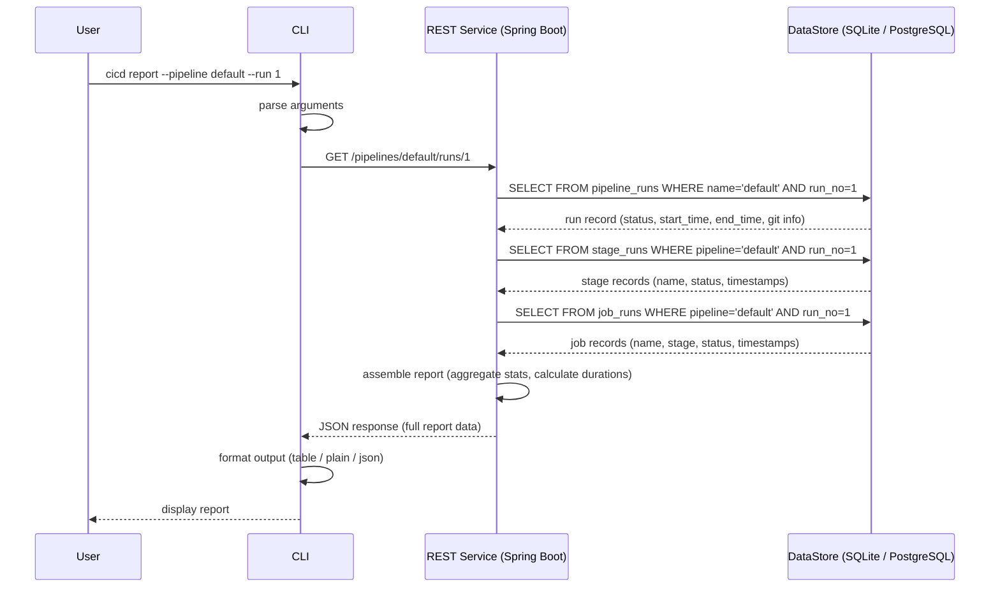

# Sequence Diagrams

## 1. Pipeline Execution (`cicd run`)

Happy path — all stages and jobs succeed.

### Step Descriptions

- **CLI request**: CLI sends `repoUrl`, optional `branch` / `commit`, and pipeline selection to the REST Service.
- **Git snapshot**: REST Service clones the repository, checks out the requested branch/commit, and validates the pipeline from committed code only.
- **Workspace archive**: REST Service archives the committed snapshot and publishes it to RabbitMQ with the pipeline metadata.
- **Async execution**: Worker extracts the archive, computes stage and wave ordering, and dispatches jobs.
- **Docker execution**: Each job runs in Docker with the extracted workspace mounted locally on the worker host.
- **Status persistence**: Worker publishes status updates; server listeners persist pipeline, stage, and job state into PostgreSQL.
- **Cleanup**: Server deletes the clone after archiving; worker deletes the extracted workspace after execution.
- **Report flow**: CLI polls the report API to inspect queued, running, success, or failed runs.

---

## 2. Report Request (`cicd report`)

Query the report for a specific pipeline run.

### Step Descriptions

- **Parse arguments**: CLI extracts pipeline name (`default`) and run number (`1`) from the command
- **GET /pipelines/default/runs/1**: CLI sends the report request to the REST Service over HTTP
- **Query pipeline run**: REST Service queries the `pipeline_runs` table for the matching run record
- **Query stages**: REST Service queries `stage_runs` for all stages in that run
- **Query jobs**: REST Service queries `job_runs` for all jobs in that run
- **Assemble report**: REST Service aggregates the data — total duration, per-stage/per-job timing, success/failure counts
- **Return report**: REST Service sends the assembled report back as JSON
- **Format & display**: CLI formats the output based on user preference (table, plain text, or raw JSON) and displays it
