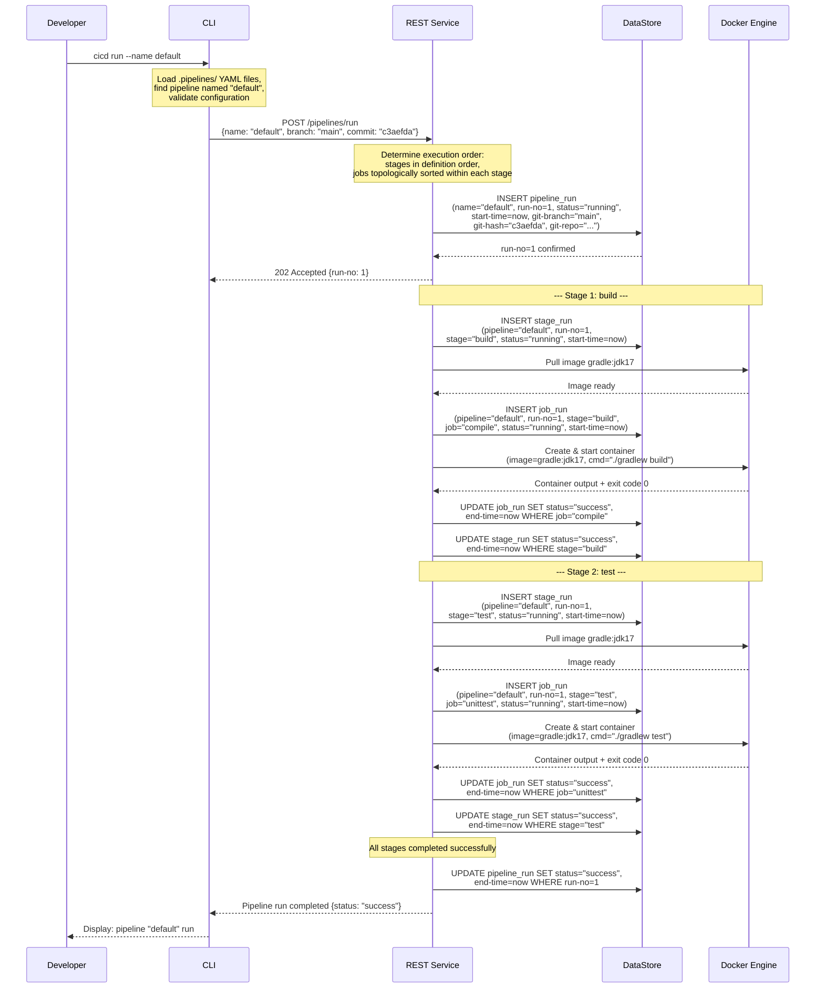
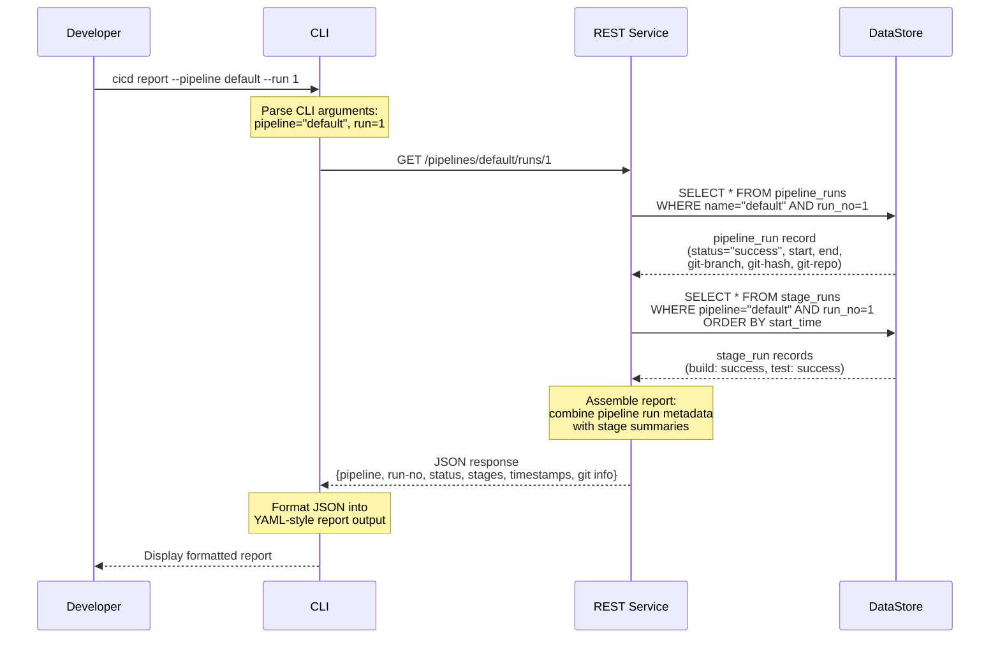

# Sequence Diagrams

This document contains sequence diagrams for the two primary use cases of our CI/CD system: pipeline execution and report generation.

## 1. Pipeline Execution (Happy Path)

This diagram shows the full flow of `cicd run --name default` when all stages and jobs succeed. The pipeline used in this example has two stages (`build` with one job `compile`, and `test` with one job `unittest`).



### Step-by-Step Explanation

1. **Developer invokes CLI** -- The developer runs `cicd run --name default`. The CLI locates the YAML configuration file for the pipeline named "default" under `.pipelines/` and validates it.

2. **CLI sends run request** -- The CLI sends an HTTP POST to the REST Service with the pipeline name, current git branch, and commit hash.

3. **REST Service creates run record** -- The REST Service inserts a new `pipeline_run` record into the DataStore with status "running" and records the git metadata (branch, hash, repo).

4. **REST Service acknowledges** -- The REST Service returns a 202 Accepted response with the assigned run number.

5. **Stage 1 (build) begins** -- The REST Service creates a `stage_run` record for the "build" stage and starts processing its jobs.

6. **Job execution** -- For each job in the stage, the REST Service:
   - Creates a `job_run` record with status "running"
   - Pulls the Docker image (if not already cached)
   - Creates and starts a container with the specified script command
   - Waits for the container to complete
   - Updates the `job_run` record with the result (status and end-time)

7. **Stage completion** -- After all jobs in a stage succeed, the REST Service updates the `stage_run` record to "success".

8. **Next stage** -- The REST Service proceeds to the next stage ("test") and repeats the same process.

9. **Pipeline completion** -- After all stages complete successfully, the REST Service updates the `pipeline_run` record to "success" with the end-time.

10. **Result returned** -- The REST Service sends the final result back to the CLI, which displays a success message to the developer.

---

## 2. Report Request (Happy Path)

This diagram shows the flow of `cicd report --pipeline default --run 1` where the user requests a report for a specific run of the "default" pipeline. The DataStore contains valid historical data and the request succeeds.



### Sample Output

For the invocation `cicd report --pipeline default --run 1`, the formatted output would be:

```yaml
pipeline:
  name: default
  run-no: 1
  status: success
  start: 2025-08-29T16:17:52-07:00
  end: 2025-08-29T16:24:32-07:00
  stages:
     - name: build
       status: success
       start: 2025-08-29T16:18:05-07:00
       end: 2025-08-29T16:19:32-07:00
     - name: test
       status: success
       start: 2025-08-29T16:20:23-07:00
       end: 2025-08-29T16:21:32-07:00
```

### Step-by-Step Explanation

1. **Developer invokes CLI** -- The developer runs `cicd report --pipeline default --run 1`. The CLI parses the arguments to identify the target pipeline and run number.

2. **CLI sends report request** -- The CLI sends an HTTP GET request to the REST Service at the endpoint corresponding to the specific pipeline run.

3. **REST Service queries pipeline run** -- The REST Service queries the DataStore for the `pipeline_runs` record matching the pipeline name and run number. This returns the run metadata: status, timestamps, and git information.

4. **REST Service queries stage data** -- The REST Service queries the DataStore for all `stage_runs` records associated with this pipeline run, ordered by start time. This returns the status and timestamps for each stage.

5. **REST Service assembles report** -- The REST Service combines the pipeline run metadata with the stage summaries into a single response object.

6. **Response returned to CLI** -- The REST Service sends the assembled report back to the CLI as a JSON response.

7. **CLI formats and displays** -- The CLI converts the JSON response into the YAML-style report format specified in the requirements and prints it to the developer's terminal.
