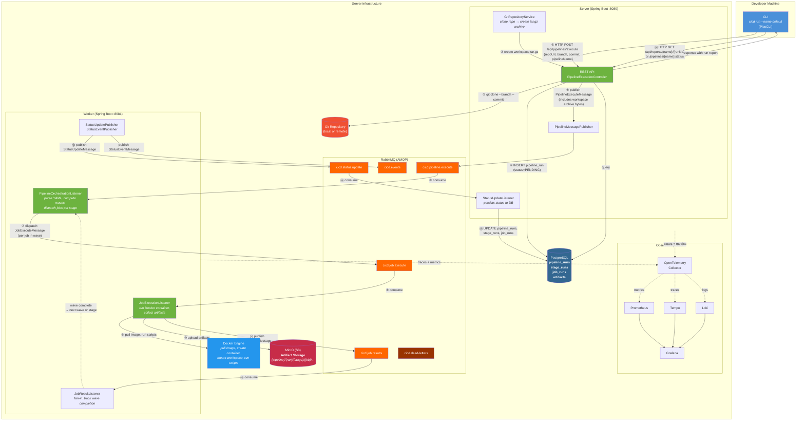
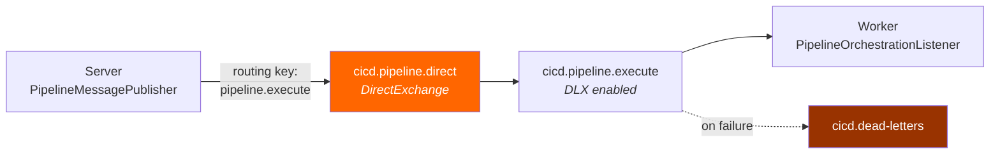
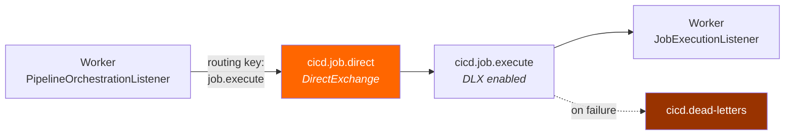
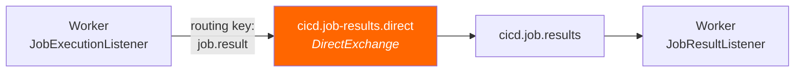
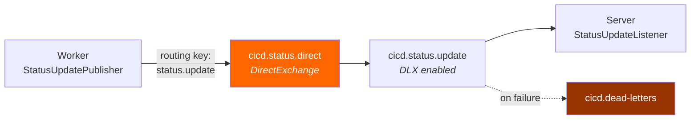
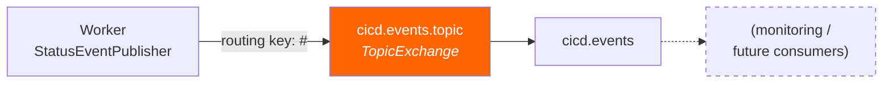
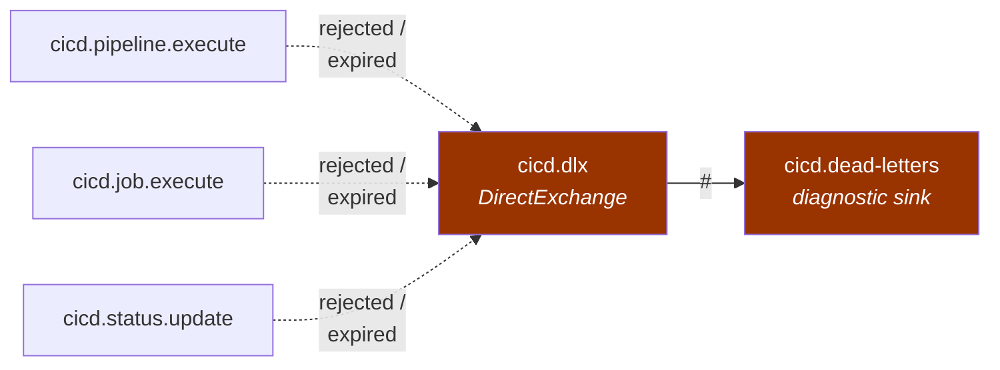
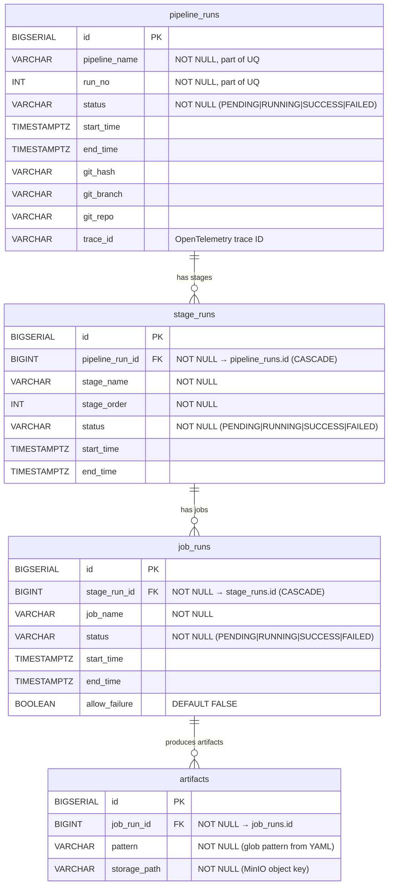
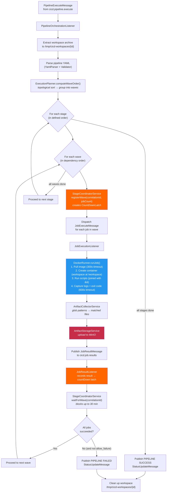

# System Architecture Diagrams

## Diagram 1: High-Level System Architecture

This diagram walks through the end-to-end execution flow of `cicd run --name default`, showing
the order of execution, what each component does, how data flows, and where data gets persisted.

- Simplified architecture

- Detailed architecture:


### Execution Order Summary

| Step | Component | Action | Data Persisted |
|------|-----------|--------|----------------|
| ① | CLI → Server | HTTP POST with repoUrl, branch, commit, pipelineName | -- |
| ② | Server | Clone git repo at specified branch/commit | -- |
| ③ | Server | Create tar.gz workspace archive from cloned repo | -- |
| ④ | Server → PostgreSQL | Insert `pipeline_runs` row (status=PENDING) | `pipeline_runs` |
| ⑤ | Server → RabbitMQ | Publish `PipelineExecuteMessage` (includes archive bytes + traceId) | -- |
| ⑥ | Worker | Consume pipeline message, extract archive, parse YAML, compute wave order | -- |
| ⑦ | Worker → RabbitMQ | Dispatch `JobExecuteMessage` for each job in current wave | -- |
| ⑧ | Worker | Consume job message | -- |
| ⑨ | Worker → Docker | Pull image, create container with workspace mounted, execute scripts | -- |
| ⑩ | Worker → MinIO | Upload collected artifacts to S3 storage | MinIO objects |
| ⑪ | Worker → RabbitMQ | Publish `JobResultMessage` (exitCode, output, artifactPaths) | -- |
| ⑫ | Worker | Fan-in: track wave completion via CountDownLatch | -- |
| ⑬ | Worker → RabbitMQ | Publish `StatusUpdateMessage` for pipeline/stage/job state changes | -- |
| ⑭ | Server | Consume status updates from queue | -- |
| ⑮ | Server → PostgreSQL | Update `pipeline_runs`, `stage_runs`, `job_runs`, `artifacts` | All 4 tables |
| ⑯ | CLI → Server | HTTP GET for reports/status → query PostgreSQL → return to CLI | -- |

### Where Data Gets Persisted

| Store | What | Durability |
|-------|------|------------|
| **PostgreSQL** | Pipeline runs, stage runs, job runs, artifact metadata (timestamps, status, git info) | Permanent (survives restarts in remote mode) |
| **MinIO (S3)** | Artifact files (`{pipeline}/{run-no}/{stage}/{job}/{file}`) | Permanent |
| **RabbitMQ** | In-flight messages (durable queues with DLX for failed messages) | Transient (delivery guarantee) |

---

## Diagram 2: System Components Detail

### 2a. RabbitMQ Message Topology

Each row below is one message channel: **Publisher → Exchange → Queue → Consumer**.
Queues marked with DLX route failed messages to the dead-letter queue for inspection.

#### Channel 1: Pipeline Dispatch (Server → Worker)



> Server publishes a `PipelineExecuteMessage` (pipeline YAML + workspace tar.gz + git metadata).
> Worker's orchestrator consumes it and begins stage/wave execution.

#### Channel 2: Job Dispatch (Worker Orchestrator → Worker Job Executor)



> Orchestrator dispatches one `JobExecuteMessage` per job in the current wave.
> Job executor runs the Docker container and collects artifacts.

#### Channel 3: Job Results (Worker Job Executor → Worker Orchestrator)



> Job executor publishes a `JobResultMessage` (exit code, output, artifact paths).
> Result listener records it in the wave tracker and counts down the fan-in latch.

#### Channel 4: Status Updates (Worker → Server)



> Worker publishes `StatusUpdateMessage` on every state change (pipeline/stage/job RUNNING, SUCCESS, FAILED).
> Server consumes and persists to PostgreSQL. This is how execution results reach the database.

#### Channel 5: Events Stream (Worker → Monitoring)



> Worker publishes `StatusEventMessage` for real-time notifications (started, completed).
> Currently no active consumer -- available for future dashboards or webhooks.

#### Dead Letter Exchange (failed messages sink)



> Three critical queues (pipeline, job, status) route failures here.
> Two non-critical queues (job results, events) do not -- timeouts handle those cases.
> No active consumer: messages accumulate for manual inspection via RabbitMQ Management UI.

#### Message Schemas

**PipelineExecuteMessage** (Server → Worker via `cicd.pipeline.execute`)

| Field | Type | Description |
|-------|------|-------------|
| `pipelineRunId` | Long | DB primary key for the pipeline run |
| `pipelineName` | String | Pipeline name from YAML |
| `runNo` | int | Auto-incremented run number |
| `pipelineYaml` | String | Raw YAML content of the pipeline config |
| `workspaceArchive` | byte[] | tar.gz of the git repo snapshot |
| `gitBranch` | String | Branch checked out |
| `gitCommit` | String | Commit hash |
| `traceId` | String | OpenTelemetry trace ID for distributed tracing |

**JobExecuteMessage** (Worker Orchestrator → Worker Job Executor via `cicd.job.execute`)

| Field | Type | Description |
|-------|------|-------------|
| `pipelineRunId` | Long | Pipeline run FK |
| `correlationId` | String | Unique ID for wave fan-in coordination |
| `jobName` | String | Job name from YAML |
| `stageName` | String | Stage this job belongs to |
| `pipelineName` | String | Pipeline name |
| `runNo` | int | Run number |
| `image` | String | Docker image to pull |
| `scripts` | List\<String\> | Commands to execute in container |
| `workspacePath` | String | Path to extracted workspace on disk |
| `totalJobsInWave` | int | Total jobs in this wave (for fan-in) |
| `allowFailure` | boolean | Whether job failure is non-blocking |
| `artifacts` | List\<String\> | Glob patterns for artifact collection |

**JobResultMessage** (Worker Job Executor → Worker Orchestrator via `cicd.job.results`)

| Field | Type | Description |
|-------|------|-------------|
| `pipelineRunId` | Long | Pipeline run FK |
| `correlationId` | String | Matches the wave correlation ID |
| `jobName` | String | Job that completed |
| `stageName` | String | Stage of the job |
| `pipelineName` | String | Pipeline name |
| `success` | boolean | Whether the job succeeded |
| `exitCode` | int | Docker container exit code |
| `output` | String | Captured container stdout/stderr |
| `allowFailure` | boolean | Whether failure is tolerated |
| `collectedArtifacts` | List\<String\> | MinIO storage paths of uploaded artifacts |

**StatusUpdateMessage** (Worker → Server via `cicd.status.update`)

| Field | Type | Description |
|-------|------|-------------|
| `entityType` | String | `"PIPELINE"`, `"STAGE"`, or `"JOB"` |
| `pipelineRunId` | Long | Pipeline run FK |
| `pipelineName` | String | Pipeline name |
| `runNo` | int | Run number |
| `stageName` | String | Null for pipeline-level updates |
| `stageOrder` | Integer | Stage position (for creating stage records) |
| `jobName` | String | Null for pipeline/stage-level updates |
| `status` | String | `"PENDING"`, `"RUNNING"`, `"SUCCESS"`, `"FAILED"` |
| `startTime` | OffsetDateTime | When execution started |
| `endTime` | OffsetDateTime | When execution ended |
| `allowFailure` | Boolean | Job allow-failure flag |
| `traceId` | String | Trace ID (pipeline-level only) |
| `artifactPatterns` | List\<String\> | YAML artifact patterns (job-level) |
| `artifactStoragePaths` | List\<String\> | MinIO paths (job completion) |

**StatusEventMessage** (Worker → Events Topic via `cicd.events`)

| Field | Type | Description |
|-------|------|-------------|
| `eventType` | String | Event category (e.g., `"STARTED"`, `"COMPLETED"`) |
| `pipelineRunId` | Long | Pipeline run FK |
| `pipelineName` | String | Pipeline name |
| `runNo` | int | Run number |
| `stageName` | String | Stage name (if applicable) |
| `jobName` | String | Job name (if applicable) |
| `status` | String | Current status |
| `timestamp` | OffsetDateTime | When the event occurred |
| `message` | String | Human-readable event description |

---

### 2b. Database ER Diagram



#### Indexes

| Index | Table | Column(s) | Purpose |
|-------|-------|-----------|---------|
| `uq_pipeline_run` | `pipeline_runs` | `(pipeline_name, run_no)` | Unique constraint |
| `idx_pipeline_runs_name` | `pipeline_runs` | `pipeline_name` | Fast lookup by name |
| `idx_stage_runs_pipeline` | `stage_runs` | `pipeline_run_id` | Join performance |
| `idx_job_runs_stage` | `job_runs` | `stage_run_id` | Join performance |

#### Cascade Behavior

- Deleting a `pipeline_runs` row cascades to its `stage_runs`
- Deleting a `stage_runs` row cascades to its `job_runs`
- `artifacts` reference `job_runs` (no cascade defined — explicit cleanup needed)

---

### 2c. Worker Internals: Wave-Based Execution



#### Wave Execution Example

Given this pipeline with `needs` dependencies:

```yaml
stages:
  - build
  - test

compile:
  stage: build
  image: gradle:jdk21
  script: gradle build

lint:
  stage: test
  image: gradle:jdk21
  script: gradle checkstyle

unit-tests:
  stage: test
  image: gradle:jdk21
  needs: [lint]
  script: gradle test

integration-tests:
  stage: test
  image: gradle:jdk21
  needs: [unit-tests]
  script: gradle integrationTest
```

The ExecutionPlanner produces:

| Stage | Wave | Jobs (run in parallel) |
|-------|------|----------------------|
| build | 1 | `compile` |
| test | 1 | `lint` |
| test | 2 | `unit-tests` (needs lint) |
| test | 3 | `integration-tests` (needs unit-tests) |

- Wave 1 of `test` starts after `build` stage completes
- Wave 2 starts only after all Wave 1 jobs finish
- Wave 3 starts only after all Wave 2 jobs finish
- Jobs within the same wave run concurrently
